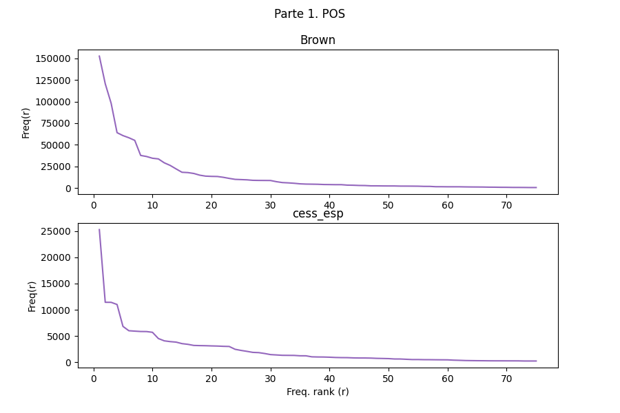
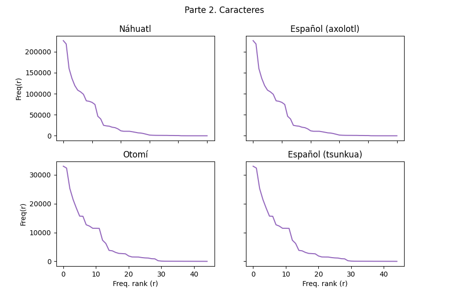
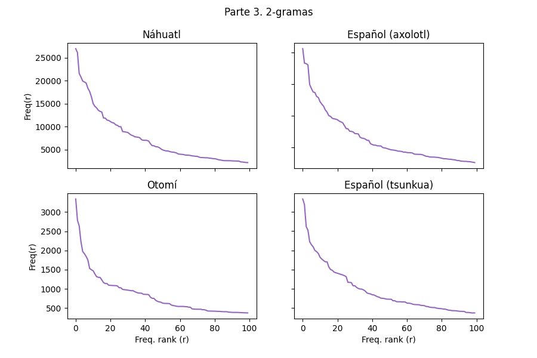
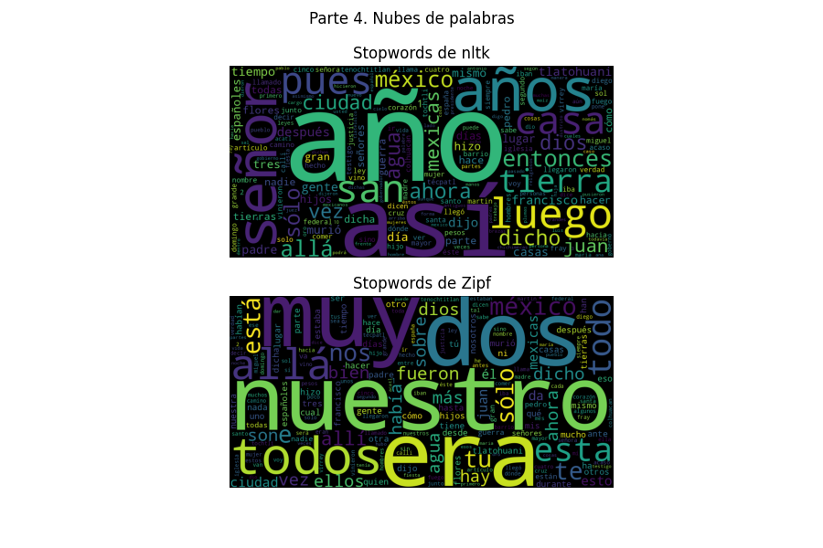
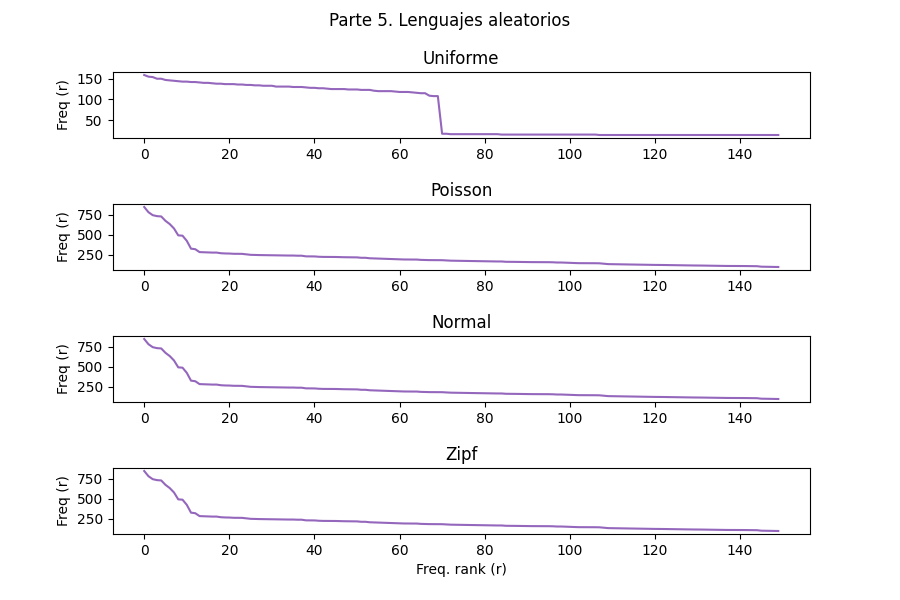

# Práctica 04 - Zipf
## Presentación
Usando el corpus *axolotl* (náhuatl) y *tsunkua* (otomí) de Elotl, *Brown* (inglés) y *cess_esp* (español) de NLTK se hacen análisis a diferentes niveles de la lengua. El trabajo se divide en 5 partes:
1. **Parts of Speech**. Comprueba que la distribución de las etiquetas POS de *Brown* y de *cess_esp* sigue una distribución de Zipf.

2. **Caracteres**. Comprueba que la distribución de caracteres en *axolotl*, y *tsunkua* en sus L1 y L2 sigue una distribución de Zipf.

3. **n-gramas**. Comprueba que la distribución de 2-gramas en *axolotl*, y *tsunkua* en sus L1 y L2 sigue una distribución de Zipf.

4. **Nubes de palabras**. Genera nubes de palabras filtrando (1) a las *stopwords* de NLTK y (2) las palabras más comunes en el corpus de español.

5. **Lenguajes aleatorios**. Genera lenguajes aleatorios con longitud de palabras una v.a. Poisson(4) + 1, y con alfabeto distribuido con Uniforme(0,70), Poisson(k), Normal(k,40), Zipf(3). Con k la posición de una letra del alfabeto escogida uniformemente.

## Instalación y ejecución
1. Se requiere instalar los siguientes paquetes y dependencias en el entorno de Python donde se vaya a ejecutar el programa. 
	1. numpy
	2. elotl (Corpus en otomí y náhuatl)
    3. nltk
        1. brown (corpus etiquetado en inglés)
        2. cess_esp (corpus etiquetado en español)
        3. stopwords (palabras de relleno)
    4. matplotlib (Gráficos)
    5. rich (Visualización de datos en consola)
    6. wordcloud (Nubes de palabras)
2. Dependiendo de los recursos disponibles, puede que sea necesario modificar algunos parámetros:

|Parámetro|N. Línea| Función
|-|-|-|
|n|202|Cantidad de palabras más frecuentes
|most_common_count|327|Cantidad de 2-gramas más comunes
|n|407|Cantidad de stopwords en español a comparar
|n|491|Cantidad de palabras a generar
|most_common_count|493|Cantidad de palabras más frecuentes

3. Ejecutar `p04-zipf.py`.

## Resultados
1. Podemos ver que en las gráficas de la parte 1, las etiquetas POS en inglés (del corpus brown) cumplen con una distribución de Zipf de una manera muy marcada. Sin embargo, como el español es más rico morfológicamente, y el corpus tiene menor tamaño, las primeras etiquetas tienen un cambio más brusco; mas la forma general se asemeja a una distribución Zipf.
2. De manera muy marcada podemos apreciar una transición de fase en los 4 corpus (en náhuatl, otomí, y español). Los 10 caracteres más frecuentes en los 4 corpus cumplen con la ley de Zipf. Desde el 11vo caracter hasta el último analizado cumplen con la ley de Zipf. Sin embargo, la forma de las curvas cambia. Sera necesario revisar si tiene que ver con el tamaño del alfabeto, el corpus, o es una propiedad emergente.
3. Los 2-gramas en náhuatl, otomí, y español cumplen con la ley de Zipf.
4. Encontrando las stopwords a partir de Zipf (sobre los corpus en español de *axolotl* y *tsunkua*) y en el corpus *stopwords* de NLTK hay relativamente pocas diferencias. Sin embargo, al ser las palabras más frecuentes, el hecho de que difieran en unas cuantas palabras, afecta la distribución de las palabras en los corpus.
5. Con respecto a la creación de lenguajes aleatorios, notamos una transición de fase con un alfabeto con distribución uniforme cuando se alcanza la longitud del alfabeto. Con las demás distribuciones podemos observar una transición de fase alrededor de la 15a palabra más frecuente donde cambia la forma de la curva. Por lo que la forma de las últimas distribuciones se aproxima a una Zipf.

## Notas
La implementación del programa requiere del procesamiento y generación de datos diversos. Aún con corpus *pequeños*, el procesamiento y visualización requiere de tiempo. No asustarse si la máquina no responde por 1 minuto. 