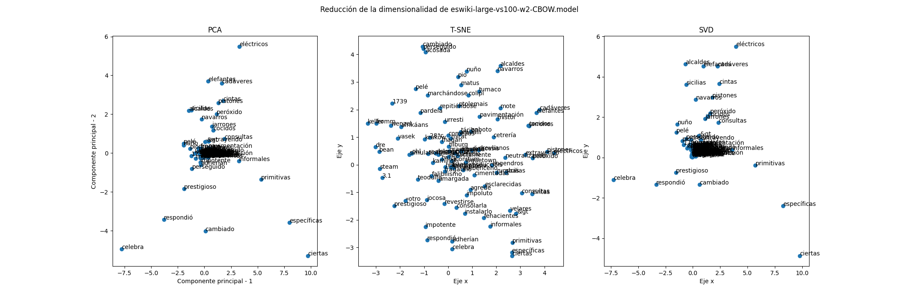

# Práctica 6 Word Embeddings
## Presentación
Usando Principal Component Analysis (PCA), t-Distributed Stochastic Neighbor Embedding (T-SNE), y Singular Value Descomposition (SVD) truncado para reducir la dimensionalidad de un modelo pre-entrenado (eswiki-large-vs100-w2-CBOW) 
## Instalación y ejecución
1. Se requiere instalar los siguientes paquetes y dependencias en el entorno de Python donde se vaya a ejecutar el programa. 
	1. numpy (versión 1.24.4 en adelante)
	2. gensim (word2vec)
    3. sci-kit learn (técnicas de reducción de dimensionalidad)
    4. matplotlib (Gráficos)
2. Dependiendo del modelo que se quiera analizar y su localización, puede que sea necesario modificar algunos parámetros:

|Parámetro|N. Línea| Función
|-|-|-|
|directory|13|Directorio donde se encuentra el modelo
|model_name|14|Modelo a analizar
|n_palabras|32|Número de palabras a analizar

3. Ejecutar `p06-word-embeddings.py`.

## Resultados

1. Notemos que PCA y SVD comparten una distribución donde la mayoría de los puntos se encuentran concentrados cerca del origen. Y de cierta manera funcionan una manera similar al conservar la relación entre nodos.
2. T-SNE al depender más de los vecinos y las relaciones entre ellos, permite lidiar con el problema de la dispersión de los datos, conservando más información a comparación del truncamiento del SVD o el usar PCA.
3. Las 3 preserva en mayor o menor medida la dirección general de la dirección entre dos palabras cualesquiera, podemos tomar por ejemplo a "primitivas", "específicas", y "ciertas" que ambas pasan en una línea recta ordenándose de arriba hacia abajo en ese orden y esa relación se preserva en cualquiera de los tres métodos.
