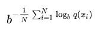
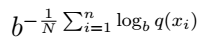

Autor: Mikel Segura Elizalde | Número de cuenta: 420004231 | Versión: 1; noviembre 2023

# Respuestas a las preguntas

## Cómo calcular la perplejidad de un modelo del lenguaje y cómo evaluarlo con esa medida:

	Para obtener la perplejidad de un modelo, se necesita contar con un conjunto de 
	muestras (oraciones) x_1, ..., x_n que no forman parte del corpus de 
	entrenamiento. De estas muestras obtenemos entonces las predicciones por el 
	modelo: q(x_i), el cual toma valores desde la distribución de probabilidad 
	obtenida durante el entrenamiento. Así, la perplejidad del modelo es:

	En este caso, se usó a b=e. Es decir, el logaritmo usado fue el logaritmo 
	natural.

	Sin embargo, en PLN se utiliza más la perplejidad por palabra, el cual 
	normaliza la perplejidad por la longitud del texto. La forma en la que se 
	calcula es similar a la perplejidad antes definida, salvo por N, que a 
	diferencia de n que representa la cantidad de oraciones, N representa la 
	cantidad de palabras del texto:

	La fórma de evaluar el modelo usando esta medida es: entre menor perplejidad, 
	mejor el modelo.

## Comparación de los resultados entre los diferentes modelos del lenguaje (bigramas, trigramas):

	La perplejidad del modelo de bigramas es más de diez veces mayor que la del 
	modelo de trigramas. También la perplejidad por palabra del modelo de 
	bigramas es mayor que la del modelo de trigramas.

## ¿Cual fue el modelo mejor evaluado? ¿Porqué?

	El modelo de trigramas fue el mejor evaluado; debido a que menor perplejidad 
	representa un mejor modelo. Esto a su vez se debe a que la estimación de la 
	probabilidad mediante trigramas cuenta con un historial más largo, lo cual 
	hace más certera la predicción de una frase.

# Cómo correr el script:

Basta con abrir modelos.py usando Python3.

## Qué dependencias usadas no vienen incluidas en Python3:

- [requests](https://pypi.org/project/requests/)
- [scikit-learn](https://scikit-learn.org/stable/install.html)
- [numpy](https://numpy.org/install/)

# IMPORTANTE

De todo el corpus preparado, sólo se utilizan 100 oraciones. Parece ser que en Google Colab, en la versión gratis, se pueden procesar hasta 126 oraciones para el modelo de trigramas. Corriendo el script en Python3 nativo en una laptop de varios años de antigüedad, puede demorar alrededor de dos minutos. Ver la línea 33 del script modelos.py para extender o reducir la porción del corpus utilizada.